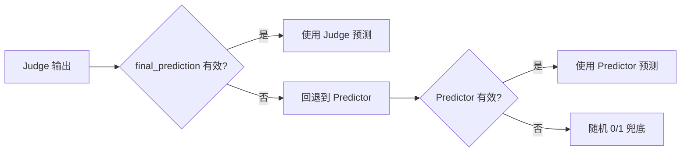

## 任务目标：依据前驱知识点构建数据集的知识图谱

**实验方案简介**：利用学生的做题记录挖掘知识点之间的拓扑前驱关系，构建知识图谱；利用预测集做题记录验证图谱在下游任务（如认知诊断/知识追踪）中的预测效果。

---

## 核心算法流水线（Pipeline）

整个知识图谱拓扑边的构建遵循 **“基础数据聚合 $\rightarrow$ 相关性初筛 $\rightarrow$ 方向性深挖”** 的流水线。任何一个步骤未满足硬性条件，该知识点对 $(i, j)$ 将被立即丢弃，不再执行后续计算。

```
[步骤 1: 笛卡尔积统计] ──> 聚合出全局 a, b, c, d 频次
                                │
                                ▼
[步骤 2: 关联强度初筛] ──> 【硬性卡点】 φ ≥ 0.35 ？
                                │ Yes
                                ▼
[步骤 3: 方向判别定边] ──> 【硬性卡点】 样本频次卡点 (单点与联合成功数) ？
                                │ Yes
                                ▼
                           【硬性卡点】 正向、反向置信度与综合得分均 ≥ 0.6 ？
                                │ Yes
                                ▼
                        生成有效拓扑边 i -> j （i是j的前驱）

```

---

### 步骤 1：基础数据聚合（$a, b, c, d$ 统计量计算）

在真实数据集中，**知识点与题目通常是一对多**的关系。为了在知识点级别精准挖掘前驱关系，系统通过学生做题记录的**题目对（Question Pairs）笛卡尔积**来累加计算 $a, b, c, d$。

#### 1.1 核心统计逻辑

对于任意两个知识点 $i$ 和 $j$：

* **构建题目对**：对于同时做过这两个知识点相关题目的某位学生，将其做过的 $Q_i$ 题目子集与 $Q_j$ 题目子集进行两两组合（笛卡尔积），形成题目对集合：

$$Pair(i, j) = \{(q_m, q_n) \mid q_m \in Q_i \land q_n \in Q_j\}$$


* **状态映射**：遍历题目对，根据学生在这两道题上的实际得分（1为对，0为错），计入对应的计数器：
* $a = i\text{错} j\text{错}$
* $b = i\text{错} j\text{对}$
* $c = i\text{对} j\text{错}$
* $d = i\text{对} j\text{对}$


* **全局聚合**：遍历训练集中所有学生的做题记录，完成最终频次的全局叠加。

#### 1.2 边界条件与缺省规则

* **完全未接触则跳过**：若某学生**从未做过**知识点 $i$ 的任何题目，**或者**从未做过知识点 $j$ 的任何题目，该生贡献的题目对数量为 $0$，**完全不参与统计**。
* **部分做题动态收缩**：若学生仅做了部分题目，系统会动态收缩题目集，只对该学生实际产生了做题记录（0或1）的题目构建笛卡尔积。
* *示例*：$i$ 包含 3 题，$j$ 包含 3 题。某学生只做了 $i$ 的 1 道题和 $j$ 的 2 道题，则该生最终仅贡献 $1 \times 2 = 2$ 个题目对，而不是 $3 \times 3 = 9$ 个。


---

### 步骤 2：【第一道筛选】强相关性过滤（Phi 系数）

$\phi$ (Phi) 系数是专门用于 $2 \times 2$ 列联表的相关性指标，用来衡量两个二分类变量之间的绝对关联强度，用以**排除偶然巧合的伪关联边**。

#### 2.1 Phi 系数公式

$$\phi = \frac{ad - bc}{\sqrt{(a + b)(c + d)(a + c)(b + d)}}$$

* **物理含义**：$\phi$ 仅衡量“关联强度”，不区分谁是前驱、谁是后继（即无方向性，$\phi(i,j) = \phi(j,i)$）。取值范围 $[-1, 1]$，越接近 1 相关性越强。

#### 2.2 🚨 步骤 2 的硬性过滤条件

计算出 $\phi$ 后，必须立刻进行以下条件判定：

> * **IF $\phi \ge 0.35$**：判定为强相关，允许进入【步骤 3】进行方向深挖。
> * **ELSE ($\phi < 0.35$ 或为负数)**：判定为弱相关或负相关。**立即直接丢弃该知识点对**，阻断后续所有计算。
> 
> 

*注意：在实验调优阶段，可分别跑 `0.3`、`0.4`、`0.5` 三个阈值进行消融实验，对比下游模型效果选最优。*

---

### 步骤 3：【第二道筛选】方向判别与最终定边

对于通过步骤 2 筛选的强相关知识点对，引入具有**方向性**的正反向置信度公式与频次限制，确立前驱拓扑方向。

#### 3.1 🚨 步骤 3 的硬性前置条件（样本频次卡点）

在进行条件概率计算前，该知识点对必须**同时满足**以下两项稀疏性卡点，以防止极少样本引起的统计偏差：

> 1. **单个知识点成功样本足量**：`len(prereq_success) >= MIN_SUCCESS_STUDENTS_FOR_CORRECTNESS`
> 2. **双知识点联合成功频次达标**：$d \ge MIN\_JOINT\_SUCCESSES\_FOR\_CORRECTNESS$
> 
> 

**以上任意一项不满足，该边直接过滤丢弃。**

#### 3.2 方向置信度计算与硬性截断

通过频次初筛后，计算并校验以下两个核心有向指标：

* **正向置信度**（做对后继 $j$ 的组合里，有多少也做对了前驱 $i$）：

$$P(I \mid J) = \frac{d}{b + d}$$


*原理：若 $i$ 是 $j$ 的前驱，掌握后继 $j$ 必然大概率能推出掌握前驱 $i$。*
> **硬性卡点**：必须满足 **$P(I \mid J) \ge 0.6$**，否则丢弃。


* **反向置信度**（做错前驱 $i$ 的组合里，有多少也做错了后继 $j$）：

$$P(\neg J \mid \neg I) = \frac{a}{a + b}$$


*原理：若前驱 $i$ 没掌握，后继 $j$ 理应大概率做错；若做错 $i$ 却能做对 $j$，说明 $i$ 不是 $j$ 的前驱。*
> **硬性卡点**：必须满足 **$P(\neg J \mid \neg I) \ge 0.6$**，否则丢弃。


#### 3.3 🚨 步骤 3 的终极硬性条件（综合得分判定）

融合正反向指标，通过**几何平均**计算最终的拓扑边权重：


$$\text{综合得分} = \sqrt[2]{P(I \mid J) \times P(\neg J \mid \neg I)}$$

最终的建边决策采用严格的**全过机制（AND 逻辑）**：

> **只有当满足以下终极硬性条件时：**
> * **正向置信度 $P(I \mid J) \ge 0.6$**
> * **且 反向置信度 $P(\neg J \mid \neg I) \ge 0.6$**
> * **且 综合得分 $\ge 0.6$**
> 
> 
> **决策**：判定该知识点对具备有效前驱关系，成功在知识图谱中构建一条有向边：**$i \longrightarrow j$**。综合得分将作为该边的权重，输入下游模型中。**反之，只要有一项低于 0.6，该边即被过滤丢弃。**


```

python generate_knowledge_graph/knowledge_graph_builder.py \
    --data-path datasets/moderate/MOOCRadar \
    --output-path datasets/knowledge_graph/MOOCRadar_knowledge_graph.json \
    --data-mode moderate \
    --train-split 1.0 \
    --exclude-first-n-students 50


python generate_knowledge_graph/knowledge_graph_builder.py \
    --data-path datasets/moderate/XES3G5M \
    --output-path datasets/knowledge_graph/XES3G5M_knowledge_graph.json \
    --data-mode moderate \
    --train-split 1.0 \
    --exclude-first-n-students 50
```
---

## 下游应用：基于知识图谱的 Few-Shot 样本选择策略（`KnowledgeGraphSelector`）

构建好的知识图谱（即 `knowledge_graph.json` 中 `is_prerequisite_for` 字段）被下游 `KnowledgeGraphSelector`（位于 `selection_strategies.py`）用于为测试题选取最相关的 few-shot 样本。该策略的核心思路是：**测试题可能包含多个知识点（Knowledge Point，以下简称 KP），对每个 KP 分别选样，最后按分层配额合并**。选样依据不仅看历史题是否包含测试知识点本身，也看是否包含其**前置知识点**（权重继承知识图谱中的 `correctness_score`）。

整个选择流水线遵循 **"构建前置索引 $\rightarrow$ 构建权重字典 $\rightarrow$ 逐知识点打分 $\rightarrow$ 分层抽样"** 的流程。任何一个阶段的数据缺陷都将触发对应的降级回退机制。

```
[测试题 skill_ids] ──> ┌──────────────────────────────────┐
                        │ 步骤 1：反转 is_prerequisite_for │
                        │ 得到 {概念 → {前驱: 权重}} 索引      │
                        └──────────────────────────────────┘
                                          │
                                          ▼
                        ┌──────────────────────────────────┐
                        │ 步骤 2：构建每 KP 权重字典         │
                        │ 自身 = 1.0 ，前驱 = correctness_score│
                        │ 每 KP 独立一份，互不干扰              │
                        └──────────────────────────────────┘
                                          │
                                          ▼
                        ┌──────────────────────────────────┐
                        │ 步骤 3：逐 KP 对所有历史题打分      │
                        │ 含本KP → 1.0                      │
                        │ 含前驱 → max(前驱权重)              │
                        │ 无关   → 0.0                      │
                        └──────────────────────────────────┘
                                          │
                                          ▼
                        ┌──────────────────────────────────┐
                        │ 步骤 4：分层抽样（三阶段）           │
                        │ ① 均分配额 + 贪心去重              │
                        │ ② 剩余候选跨组补位                 │
                        │ ③ 不足时随机填充                   │
                        └──────────────────────────────────┘
                                          │
                                          ▼
                                   按 index 排序输出
```

---

### 步骤 1：构建前置索引（Invert Prerequisite Relations）

知识图谱 JSON 中，每个概念的 `is_prerequisite_for` 字段表示 **"此概念是哪些概念的前驱"**（即此概念 → 后继）。例如：

```json
// 概念 "skill_1" 的 is_prerequisite_for：
// 含义：skill_1 是 skill_3、skill_5 的前驱（即 skill_1 → skill_3，skill_1 → skill_5）
"skill_1": {
  "is_prerequisite_for": {
    "skill_3": { "correctness_score": 0.82, ... },
    "skill_5": { "correctness_score": 0.75, ... }
  }
},
// 概念 "skill_2" 的 is_prerequisite_for：
// 含义：skill_2 也是 skill_3 的前驱（即 skill_2 → skill_3）
"skill_2": {
  "is_prerequisite_for": {
    "skill_3": { "correctness_score": 0.91, ... }
  }
}
```

为回答 **"给定概念 X，它的前驱是哪些？"** 这一问题（例如测试题考察了 skill_3，想找 skill_3 的前置知识），需要**反转**该映射关系。

反转逻辑如下：

```python
for prereq_id, node in concept_data.items():        # prereq_id = "skill_1"
    for dependent_id, data in node["is_prerequisite_for"].items():  # dependent_id = "skill_3"
        prereq_index[dependent_id][prereq_id] = score
```

得到如下索引结构 `{概念X → {前驱A: 权重, 前驱B: 权重}}`：

| 原始字段（图谱存储） | 含义 | 反转后的索引（前置索引） |
|---|---|---|
| `skill_1 → {"skill_3": 0.82, "skill_5": 0.75}` | skill_1 是 skill_3、skill_5 的前驱 | `skill_3 → {"skill_1": 0.82}`，`skill_5 → {"skill_1": 0.75}` |
| `skill_2 → {"skill_3": 0.91}` | skill_2 是 skill_3 的前驱 | `skill_3 → {"skill_2": 0.91}` |

最终生成的前置索引：

```
"skill_3" → {"skill_1": 0.82, "skill_2": 0.91}   （skill_3 的前驱是 skill_1(0.82) 和 skill_2(0.91)）
"skill_5" → {"skill_1": 0.75}                      （skill_5 的前驱是 skill_1(0.75)）
```

---

### 步骤 2：构建每个知识点的权重字典

对测试题中的**每个**知识点，独立构建一份权重字典：

| 来源 | 权重 |
|---|---|
| 该知识点自身 | **1.0**（固定） |
| 其直接前驱 | `correctness_score`（来自知识图谱），按分值降序取前 `max_related_concepts` 个 |

> 例：测试题含知识点 **i** 和 **j**，`max_related_concepts = 5`，前置索引如上：
> $$i \rightarrow \{i: 1.0,\ m: 0.9,\ n: 0.8\}$$
> $$j \rightarrow \{j: 1.0,\ p: 0.5,\ q: 0.6\}$$

> 🚨 **边界条件**：若某知识点在知识图谱中不存在或无其前驱，则权重字典退化为 `{自身: 1.0}`。

---

### 步骤 3：逐知识点对历史题打分

对测试题中每个知识点 KP$_k$，使用其权重字典 $W_k$ **独立**对该学生的所有历史题进行一次评分。对于一条历史题 $R$：

$$ \text{Score}_k(R) = \max_{\substack{c \in \text{skill\_ids}(R)}} \ W_k[c] $$

等价规则：

| 历史题包含的知识点 | 命中类型 | 分值 | 说明 |
|---|---|---|---|
| 包含该知识点自身 | 直接命中 | **1.0** | 该题直接考察了本知识点，满分 |
| 不含本知识点，但含其若干前驱 | 间接命中 | **max(前驱权重)** | 多个前驱取最高分，如 0.9 |
| 既不包含本知识点也不含其任何前驱 | 无关 | **0.0** | 不计分 |

> *例：测试知识点 **i** 的权重字典为 {i: 1.0, m: 0.9, n: 0.8}：*

| 历史题 skill_ids | 匹配过程 | 最终分数 |
|---|---|---|
| `["i"]` | max(1.0) = 1.0 | **1.0** |
| `["i", "x"]` | max(1.0, 0) = 1.0 | **1.0** |
| `["m"]` | max(0.9) = 0.9 | **0.9** |
| `["m", "n"]` | max(0.9, 0.8) = 0.9 | **0.9** |
| `["x", "y"]` | max(0, 0) = 0.0 | **0.0** |

> 🚨 **边界条件**：若历史题无 `skill_ids` 字段或为空数组，直接给 0 分。

一轮评分后，每组得到按分数降序排列的候选列表：

```
i 组: [(1.0, Q1), (1.0, Q2), (0.9, Q3), (0.9, Q4), (0.0, Q5), ...]
j 组: [(1.0, Q1), (0.6, Q4), (0.5, Q6), (0.5, Q7), (0.0, Q8), ...]
```

同分时按 `index` 升序排列。

---

### 步骤 4：分层抽样（Stratified Sampling with Dedup and Fill）

给定目标抽取数 `n_shots` 和测试知识点集合 $\{KP_1, KP_2, ..., KP_k\}$，分三阶段执行：

#### 4.1 🚨 第一阶段：均分配额 + 贪心去重

将 `n_shots` 均分到 k 个知识点，余数按顺序分配：

$$ \text{base} = \lfloor n_{\text{shots}} / k \rfloor,\quad \text{remainder} = n_{\text{shots}} \bmod k $$

$$ \text{quota}_i = \text{base} + \begin{cases} 1 & \text{if } i < \text{remainder} \\ 0 & \text{otherwise} \end{cases} $$

每个知识点从自己的候选列表中**按分数降序**依次选取，遇到已被其他知识点**选过的题则跳过**（贪心去重），直到填满配额或候选耗尽。

> **示例**（n_shots=8，KP={i, j}，配额均为 4）：
> ```
> i 组候选: [Q1(1.0), Q2(1.0), Q3(0.9), Q4(0.9), Q5(0.8), ...]
>           → 选中 Q1, Q2, Q3, Q4  ✓（配额满）
>
> j 组候选: [Q1(1.0), Q4(0.6), Q6(0.5), Q7(0.5), Q8(0.5), Q9(0.5), ...]
>           → Q1 已被选，跳过
>           → Q4 已被选，跳过
>           → 选中 Q6, Q7, Q8, Q9  ✓（配额满）
> ```
> 如果 j 组经过去重后只选到 3 条（配额余 1），进入第二阶段。

#### 4.2 🚨 第二阶段：跨组补位

第一阶段结束后，如果 `已选数量 < n_shots`，收集**所有组中未被选中**的候选记录，按分数降序排序，从最高分开始依次补选，直到补足差额：

```
第一阶段结果：已选 7 条，还差 1 条
所有组剩余候选: [(0.8, Q5), (0.5, Q10), (0.0, Q11), ...]
               → 选 Q5(0.8)  ✓
```

#### 4.3 🚨 第三阶段：随机填充

若所有组候选池均已耗尽（即没有任何历史题与任何测试知识点匹配），仍不足 `n_shots` 时，从**未被选中的全部历史记录**中随机抽取补齐：

```
仍需 2 条，无可用的高分候选
→ 从剩余历史记录中随机抽 2 条
```

#### 边界条件汇总

| 场景 | 行为 |
|---|---|
| `skill_ids` 为空 | 降级为 `RecentSelector`（取最近 n_shots 条） |
| records 为空 | 返回 `[]` |
| n_shots = 0 | 返回 `[]` |
| 某知识点无前驱 | 权重字典退化为 `{自身: 1.0}` |
| 历史题无 `skill_ids` | 该题在所有知识点组中均得 0 分 |
| 所有组候选合计 < n_shots | 第二阶段补位后，进入第三阶段随机填充 |

---

### 代码入口

```python
from selection_strategies import KnowledgeGraphSelector, create_selector

# 方式一：通过工厂函数
selector = create_selector(
    strategy="knowledge_graph",
    dataset_name="xes3g5m",
)

# 方式二：直接实例化
selector = KnowledgeGraphSelector(
    dataset_name="xes3g5m",            # 自动匹配知识图谱路径
    # 或指定路径:
    # graph_path="datasets/knowledge_graph/XES3G5M_knowledge_graph.json",
    max_related_concepts=5,            # 每个KP最多考虑的前驱数
)

selected = selector.select(
    records=historical_records,         # 学生历史做题列表
    n_shots=8,                          # 需要选取的样本数
    test_record=test_record,            # 当前测试题
)
# 返回按 index 升序排列的 selected records
```


## Predictor-Critic-Judge (PCJ) 多智能体辩论仲裁策略

**PCJ（Predictor-Critic-Judge）** 是 V3 版本引入的多智能体协作框架，通过三个不同角色的 LLM 智能体进行 **结构化辩论与仲裁**，实现对学情预测的多视角交叉验证，显著提升预测准确率与可解释性。

---

### 核心思想

模拟真实教学场景中的 **同行评议机制**：

| 角色 | 类比现实 | 职责 |
|------|----------|------|
| **Predictor（预测器）** | 班级教师 | 基于学生历史表现，给出初步预测与分析 |
| **Critic（评论家）** | 另一位教师 | 审查 Predictor 的判断是否合理，提供不同视角 |
| **Judge（法官/仲裁者）** | 教研组长 | 综合双方意见，做出最终裁决 |

---

### 流水线架构

```
                      ┌──────────────────────────────┐
                      │      学生历史 + 测试题          │
                      │  (Few-shot + User Data + KG)  │
                      └──────────┬───────────────────┘
                                 │
                                 ▼
┌─────────────────────────────────────────────────────────────────┐
│ Stage 1: Predictor（复用 V1 多轮流水线）                          │
│  ① 分析学生知识状态（analysis）                                   │
│  ② 预测学生是否能答对（prediction）                               │
│  ③ 解释预测依据（explanation）                                   │
│  Output: prediction(0/1) + analysis + explanation                │
└─────────────────────────────┬───────────────────────────────────┘
                              │
                              ▼
┌─────────────────────────────────────────────────────────────────┐
│ Stage 2: Critic（评论家审查）                                     │
│  审查 Predictor 对学生能力的评估是否合理                            │
│  Output: Verdict(support/challenge/uncertain) + Evidence + Alt   │
└─────────────────────────────┬───────────────────────────────────┘
                              │
                              ▼
┌─────────────────────────────────────────────────────────────────┐
│ Stage 3: Judge（法官最终裁决）                                     │
│  综合 Predictor + Critic，按决策规则做出最终预测                    │
│  Output: FinalPrediction(0/1) + DecisionReason + Confidence      │
└─────────────────────────────┬───────────────────────────────────┘
                              │
                              ▼
┌─────────────────────────────────────────────────────────────────┐
│ Stage 4: Result Integration（结果集成与兜底）                      │
│  验证 → 双重兜底 → 解释归约 → 输出最终结果                        │
│  Output: final_prediction + multi-perspective explanations       │
└─────────────────────────────────────────────────────────────────┘
```

---

### Stage 1：Predictor（预测器）

Predictor **复用 V1 的多轮流水线**（analysis → prediction → explanation），是一个完整的单智能体知识追踪模型。

**关键设计**：
- 使用 V1 prompts（`generic_get_prompts_v1`），与 Critic/Judge 的指令系统完全独立
- 输出结构完整：`prediction`(0/1) + `analysis`（知识状态分析）+ `explaination`（预测理由）
- 保证初始预测的 baseline 质量

```python
# 代码入口：LLMEvaluatorV3.evaluate() Stage 1
producer_prompts = generic_get_prompts_v1(model_family, data_mode)
producer_result = self.producer_evaluator.evaluate(
    student_info, test_exercise_info, extra_datas,
    eval_strategy, fewshots, producer_prompts, data_mode,
)
# → 产出: prediction, analysis, explaination
```

---

### Stage 2：Critic（评论家）

Critic 的核心职责是评估 Predictor 的**学生能力判断**是否有历史证据支持，而不是去判断题目本身的正确答案。

#### 2.1 审查维度

| 维度 | 说明 |
|------|------|
| 学生直接经验 | 历史中是否有相同知识点的题目？表现如何？ |
| 前置知识迁移 | 虽无直接经验，但前置知识点掌握如何？ |
| 整体表现趋势 | 学生的全局正确率反映其整体能力水平 |

#### 2.2 结构化输出

```xml
<Critique>
  <Verdict>support|challenge|uncertain</Verdict>
  <Flaws>Predictor 学生能力评估中的缺陷</Flaws>
  <Evidence>来自学生历史的能力证据</Evidence>
  <AlternativePrediction>0 或 1（仅 high confidence 时提供）</AlternativePrediction>
  <Confidence>low|medium|high</Confidence>
</Critique>
```

#### 2.3 新概念处理（核心创新）

当学生历史中没有当前知识点的直接记录时，Critic 不会简单支持"预测答错"，而是：

1. **检查前置知识点掌握**：通过知识图谱获取当前知识点的前置概念，评估学生是否具备**知识迁移能力**
2. **计算整体正确率**：好学生（>70% 正确率）遇到新概念更可能通过知识迁移答对

```
示例：
  知识点 "二元一次方程组" 对学生是新的
  但学生已掌握前置知识点 "一元一次方程"（正确率 90%）
  → 学生具备知识迁移能力，不应简单预测答错
```

---

### Stage 3：Judge（法官）

Judge 是最终仲裁者，按照一套 **优先级明确的决策规则** 综合 Predictor 和 Critic 的输出。

#### 3.1 决策规则矩阵

| Critic Verdict | Critic Confidence | Judge 决策 |
|----------------|-------------------|-----------|
| `support` | 任意 | **接受 Predictor** |
| `challenge` | `high` + 学生能力证据 | **考虑采纳 Critic 的备选预测** |
| `challenge` | `medium/low` | **维持 Predictor** |
| `uncertain` | 任意 | **触发主动评估逻辑（见 3.2）** |
| Critic 谈论"正确答案"而非学生能力 | 任意 | **忽略 Critic，维持 Predictor** |

#### 3.2 Uncertain 处理逻辑（主动评估）

当 Critic 不确定时，Judge **主动计算学生整体正确率**来做决策：

```
IF critic verdict == "uncertain":
    计算学生整体正确率 = correct / total

    IF 正确率 > 70%（好学生）+ 预测是答错新概念:
        → 改为预测答对（知识迁移）
    ELSE IF 正确率 < 50%（差学生）:
        → 维持 Predictor
    ELSE（50%-70%）:
        → 维持 Predictor
```

#### 3.3 结构化输出

```xml
<Judge>
  <FinalPrediction>0 或 1</FinalPrediction>
  <DecisionReason>最终裁决理由</DecisionReason>
  <ProducerAssessment>对 Predictor 预测的评价</ProducerAssessment>
  <CriticAssessment>对 Critic 挑战的评价</CriticAssessment>
  <Confidence>low|medium|high</Confidence>
</Judge>
```

---

### Stage 4：结果集成与兜底

Judge 的输出经过校验和兜底机制后，生成最终结果。

#### 4.1 双重兜底



#### 4.2 解释归约

最终预测的解释按优先级取用，保证最丰富的可解释性：

```
final_explanation = judge.decision_reason
                ?? critic.evidence
                ?? producer.explaination
                ?? ""
```

#### 4.3 完整可解释性输出

V3 的每条预测附带 **三重解释**：

| 来源 | 字段 | 内容 |
|------|------|------|
| Predictor | `analysis` | 知识状态分析 |
| Predictor | `producer_explaination` | 初始预测理由 |
| Critic | `critic_verdict` + `critic_explaination` | 审查结论与证据 |
| Judge | `judge_explaination` | 最终裁决理由 |

---

### 知识图谱增强的 Few-Shot 选择

V3 的 few-shot 选择与 V1/V2 共享知识图谱增强策略（详见前文"基于知识图谱的 Few-Shot 样本选择策略"），通过 `KnowledgeGraphSelector` 筛选包含当前知识点及其前置知识点的历史题目，为每个智能体提供**更丰富的学生能力证据**。

---

### V1 vs V2 vs V3 对比

| 维度 | V1（基线） | V2 | V3（PCJ，本方法） |
|------|-----------|-----|-------------------|
| 智能体数量 | 1 | 1 | **3** |
| 架构模式 | 单智能体多轮 | 单智能体单轮 | **多智能体辩论仲裁** |
| 决策机制 | 直接输出 | 直接输出 | **结构化交叉验证** |
| 新概念处理 | 无特殊处理 | 无特殊处理 | **知识图谱前置关系 + 知识迁移推理** |
| 容错性 | 单点失败 | 单点失败 | **双重兜底 + 多视角制衡** |
| 可解释性 | 单视角 | 单视角 | **Predictor + Critic + Judge 三重解释** |
| LLM 调用次数 | 3 次/题 | 1 次/题 | 3 次/题（Predictor 3次 + Critic 1次 + Judge 1次） |
| 调用模式 | 串行 | 串行 | **串行辩论** |

---

### 使用方法

```bash
# 运行 V3 流水线
python main.py \
    --model_name glm-4.7 \
    --data_mode moderate \
    --dataset_name XES3G5M \
    --fewshot_num 4 \
    --fewshot_strategy knowledge_graph \
    --eval_strategy simple \
    --version v3 \
    --test_num 20 \
    --workers 4
```

**关键参数说明**：

| 参数 | 说明 |
|------|------|
| `--version v3` | 启用 PCJ 多智能体流水线 |
| `--fewshot_strategy knowledge_graph` | 启用知识图谱增强的 few-shot 选择 |
| `--knowledge_graph_path` | 指定知识图谱 JSON 路径（可选，默认根据 dataset_name 自动匹配） |
| `--eval_strategy simple` | V3 仅支持 simple 策略（Predictor 内部使用） |

---

### 文件结构

| 文件 | 职责 |
|------|------|
| [LLM_factory/prompt_factory_v3.py](LLM_factory/prompt_factory_v3.py) | Critic/Judge 的 Prompt 定义、XML 解析函数 |
| [LLM_factory/GPT_v3.py](LLM_factory/GPT_v3.py) / [GLM_v3.py](LLM_factory/GLM_v3.py) | V3 模型类（继承 V1，重写 get_prompts/create_fewshots） |
| [LLM_factory/fewshot_generator_v3.py](LLM_factory/fewshot_generator_v3.py) | V3 few-shot 生成（复用 V1 逻辑） |
| [evaluator_factory/LLMEvaluator_v3.py](evaluator_factory/LLMEvaluator_v3.py) | **核心**：PCJ 三段式评估流水线 |
| [pipline_factory/LLM_piplines.py](pipline_factory/LLM_piplines.py) | 流水线调度：模型初始化、学生遍历、并发控制 |

---

## 实验验证：V3 有效性案例分析

以下基于 **MOOCRadar 数据集**（moderate 模式），gpt-3.5-turbo 模型，16-shot knowledge_graph 策略的对照实验数据，展示 V3（PCJ）相对于 V1 的实际改进效果。

---

### 总体指标对比

| 指标 | V1 | V3（PCJ） | 变化 |
|-----|----|-----------|------|
| Accuracy | 0.9344 | **0.9672** | **+3.28%** |
| Precision | **0.9703** | 0.9626 | -0.77% |
| Recall | 0.9515 | **1.0000** | **+4.85%** |
| F1 | 0.9608 | **0.9810** | **+2.02%** |

V3 在 **Accuracy、Recall、F1** 三项指标上全面超越 V1，其中 **Recall 达到 1.0**，意味着所有实际答对的学生都被正确识别，无一漏判。Precision 微降 0.77%，说明 V3 在纠正"漏判"时引入了少量误判，但总体效果显著提升。

---

### 纠正案例分析

在 122 条测试样本中，V3 **纠正了 V1 的 6 个错误**（同时仅引入 2 个新错误），净提升 4 个正确预测。以下是两个最具代表性的纠正案例。

---

#### 案例 1：好学生的知识迁移（Student 7, Exercise 3145）

**场景**：学生遇到一个包含新知识点"外部节点（external node）"的树结构题目。

| 版本 | 预测 | 实际 | 结果 |
|------|------|------|------|
| V1 | 0（答错） | 1（答对） | ❌ 漏判 |
| V3 PCJ | **1（答对）** | 1（答对） | ✅ 纠正 |

**Predictor（V1）判断**：预测答错（0）。

**Critic 审查**：`verdict=challenge, confidence=high`

```xml
<Evidence>
The student has a strong history of correct answers on exercises involving
complex tree structures and related concepts, such as AVL trees, splay trees,
binary search trees, and topological adjustment.
</Evidence>
```

Critic 指出：虽然"外部节点"是新知识点，但学生已掌握大量相关的树结构概念（AVL树、伸展树、二叉搜索树等），具备**知识迁移能力**，不应简单预测答错。

**Judge 裁决**：采纳 Critic 意见，改为预测答对（1）。

```xml
<DecisionReason>
The critic provides strong evidence that the student has a high overall
correctness rate and mastery of many related and prerequisite tree structure
concepts. Although "外部节点" is new, the student's demonstrated ability to
transfer knowledge across related tree topics supports predicting success.
</DecisionReason>
```

**结论**：V1 因为新知识点而保守预测答错，但 Critic 识别出学生具备知识迁移能力，Judge 采纳后成功纠正。

---

#### 案例 2：医学概念中的知识迁移识别（Student 11, Exercise 1747）

**场景**：学生需要预测一个涉及"**骨骼肌血流量**"知识点的题目，该知识点在学生历史中**从未出现过**。

| 版本 | 预测 | 实际 | 结果 |
|------|------|------|------|
| V1 | 0（答错） | 1（答对） | ❌ 漏判 |
| V3 PCJ | **1（答对）** | 1（答对） | ✅ 纠正 |

**Predictor 判断**：预测答错（0）。理由是该知识点对学生来说是新的。

**Critic 审查**：`verdict=challenge, confidence=high, alternative_prediction=1`

```xml
<Flaws>
The producer predicted the student would answer incorrectly solely because
the knowledge concept '骨骼肌血流量' is new to the student. However, the
student has demonstrated mastery across a wide range of closely related
physiological concepts involving circulatory responses, muscle function,
and stress-related mechanisms.
</Flaws>
<Evidence>
The student has mastered numerous related knowledge points such as
'心率增快', '心肌收缩力增强', '代偿反应', '血氧含量', '缺氧', '骨髓造血',
'毛细血管内压增高', and '神经肌肉兴奋性'. The student has answered all
previous exercises correctly, showing a robust understanding of
physiological compensations and muscle-related functions. The student's
overall correct rate is near 100%, indicating strong learning and transfer
capabilities. Although '骨骼肌血流量' is a new concept, the student's
mastery of prerequisite and related concepts strongly supports the ability
to answer correctly.
</Evidence>
<AlternativePrediction>1</AlternativePrediction>
<Confidence>high</Confidence>
```

Critic 精准指出了 Predictor 的关键缺陷：**仅凭"新知识点"就预测答错**，忽略了学生掌握了大量相关生理学概念的事实。Critic 列出了一系列学生已掌握的相关知识点（心率调节、代偿反应、血氧代谢等），并明确指出学生具备**知识迁移能力**。

**Judge 裁决**：采纳 Critic 意见，改为预测答对（1）。

```xml
<DecisionReason>
The critic provides strong, high-confidence evidence that the student has
mastered a wide range of closely related physiological concepts, including
cardiovascular compensations, muscle physiology, and stress responses.
Although '骨骼肌血流量' is a new knowledge point, the student's demonstrated
mastery of prerequisite and related concepts, combined with an almost perfect
historical accuracy, supports the likelihood of correct knowledge transfer
and answering correctly. Therefore, overriding the producer's prediction is
justified.
</DecisionReason>
```

**结论**：这是一个典型的 **Predictor 犯错 → Critic 提出异议 → Judge 支持 Critic** 的完整链条。Predictor 犯了单一智能体最容易犯的错误——对新知识点过于保守。Critic 通过综合评估学生的**整体能力 + 相关知识掌握 + 知识迁移潜力**，提出了 `challenge`。Judge 审查后认为 Critic 的证据充分且关联学生能力，最终**覆盖 Predictor 的预测**，做出了正确判断。这正是 PCJ 多智能体辩论仲裁的核心价值所在。

---